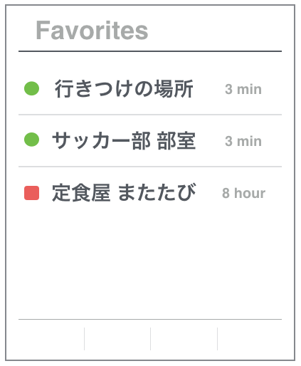
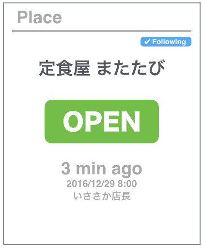
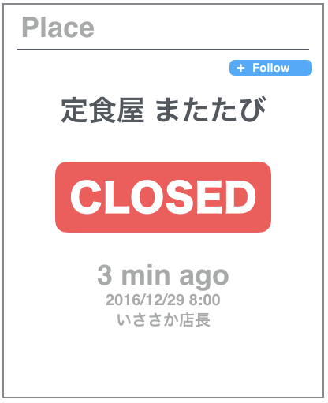

# aiteru-webapp

## Build

```
$ npm run build:all
```

## Run

### Backend

```
$ go run server.go
```


### Frontend
```
$ npm run server:h2o & tail -f tmp/h2o/access-log
```

**notice**: When you want to stop the server, execute command `fg` first. Then kill `npm run` process(`ctrl + c`). These steps also stop h2o server process.


## Images




